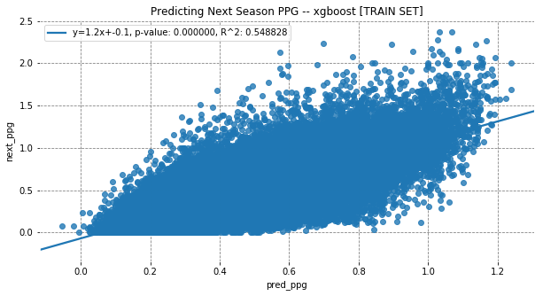

# Artificial Prospect PipeLinE (APPLE): Assisting the analysis of hockey prospects using Recurring Neural Networks
by: [Connor Jung](https://twitter.com/ConnorJungle)

## Introduction

The NHL Draft acts as the proverbial reset of the NHL calendar. Teams re-evaluate the direction of their organizations, make roster decisions, and welcome a new crop of drafted prospect into the fold. Irrespective of pick position, each team's goal is to select players most likely to play in the NHL and to sustain success. Most players arrive to the NHL in their early 20s, which leaves teams having to interpolate what a player will be 4-5 years out. This project attempts to address this difficult task of non-linear player projections. The goal is to build a model for NHL success / value through a player's development — specifically using all current/historical scoring data to estiamte the possible leagues, and performance a player should expect in subsequent seasons. 

## Past Work

A project like this is only possible by virtue of the hard work that came before it. Many of the core principles have been unchanged — such as NHL value, probability of success, league conversion, with differences only at the margins and in execution.

The list of prospect models is long, comprehensive, and dates back to hockey analytics' infancy. The work of **APPLE**'s predecesors / inspiraitons: 

* [PCS](https://jetsnation.ca/2015/05/26/draft-analytics-unveiling-the-prospect-cohort-success-model) (Lawrence, Weissbock, Tanner)

* [SEAL](https://hockey-graphs.com/2016/06/15/seal-adjusted-scoring-and-why-it-matters-for-prospects/) (Hohl)

* [pGPS](https://nextgenhockey.ca/2019/06/21/pgps-draft-slot-valuations-for-the-2019-nhl-draft/) (Davies)

* [DEV](http://archive.is/2Odvy) (Speak)

* [Model Trees for Identifying Exceptional Players in the NHL Draft](https://arxiv.org/pdf/1802.08765.pdf) (Schulte, Liu, Li)

* NHLe ([Desjardins](http://www.behindthenet.ca/projecting_to_nhl.php) / [Vollman](http://www.hockeyabstract.com/testimonials/nhltranslations) / [Tulsky](https://archive.is/h3k9l) / Perry / [Bader](https://hockeyprospecting.com/about/))

* [NNHLe](https://cj-turtoro.shinyapps.io/NNHLe-writeup/) (Turtoro)

Much of the focus on NHL Draft / Prospect work concentrates on the following objectives (and are not mutually exclusive in application):
1. Scoring Translations
2. Player Comparables
3. Optimal Draft Value

In my view, these are the foundational concepts and questions that hockey analysts set out to tackle when it comes to prospects. **APPLE** is no different — the goal is to expand on the work that's come before, and offer a different approach that address potential shortcomings like:
1. Time dependence (Age, Inter-season correlations)
2. Selection bias (Using only players that appear in multiple leagues in the same season)
3. Arbitrary response variable (ie. 200 NHL game cutoff)

**APPLE** draws on the same principles of PCS / DEV in the sense that it is trying to capture the inherent risk / reward of each player's development, however, avoids selecting clusters of players or fitting on an arbitrary target variable set to demark NHL success. We're also drawing from concepts of NHLe / NNHLe in that we're trying to estimate league equivalencies of production, albeit in season y+1 not in season y. Lastly, we're instead modelling time dependence as part of the model architecture instead of simply treating each player season independent of past performance — Cody Glass won't wake up one tomorrow looking like Nathan MacKinnon or Ryan Reeves, he will most likely be closer to a prior (himself).

## Methodology

I wrote about a prospect model last year, with the introduction of the Probability Peers prospects model (PPer). Unlike other prospect success models pGPS / PCS, the PPer was a regression model. PPer was most similar to DEV in that it was a binary classification fit on NHL Success (200 GP), with clusters fit using K-means on height / weight / probability of success to derive player comparables. In the end, I came away still feeling unsastified having not really addressed the obvious issues with an arbitrary response variable (200 GP cutoff for measure of NHL success), and taking into consideration that each player season is not indepedent — violating a key assumption of linear regression. It was just a few weeks later I published PPer that my friend [Nicole Fitzgerald](https://ninkle.github.io/) (Microsoft, soon to be MILA institute), who works in ML research, proposed these concerns could be addressed as a LSTM time series problem.

That got me thinking.

Most time series problems using Neural Networks, specifically the RNN architecture, leverages deep learning frameworks like LSTM to encode historic information about the sequence to aid prediction. Many examples of pytorch/keras tutorials look at Stock Price prediction. Hockey players are viewed as assets for their organizations, so I thought the analogy was close enough, so here we are.  

The LSTM architecture, put simply, uses sequential data to updates cell states, hidden states, and produces an output. That output is the prediction for that time-step and will be compared against the ground truth in training. The cell and hidden states are updated as sequential data is passed through the network. 


The analog hockey use-case is to treat each player as a sequence that begins when they're 17 and ends when they're 23. I chose this time window because these are the formidable development years for players, and also coincides aproximately with the draft rights an NHL team has on drafted players. Each player is initialized with the same hidden, cell state when we begin at year _y_. Then, we iteratively pass input data about the player's league, performance, measurements and other player features. The model produces an output for each time-step, ie. player performance in y+1.

What this allows us to accomplish is predict any future player performance entirely by past performance history. The goal is for the LSTM architecture to capture the time-dependent, complex non-linear patterns as players develop, and to trace their path to the NHL. 

This is far and away the biggest philosophical change to **APPLE** when trying to evaluate player development — treating time as a meaningful dimension in the problem. Not only is player age important in player development, but there are implications on salary cap and asset management as soon a player is drafted. Previous work didn't seem dynamic or global enough to accomplish this. Evaluating a prospect / pick is a careful balance between risk and reward, much like trading stocks. The goal is to model both risk and reward components separately and to bring it all together at the end to give us an expected NHL value, cut off at the age where teams lose entry-level contract rights. **APPLE** is composed on 3 main models. Using a similar set of player features as the PPer:
* Predict what League player plays in y+1
* Predict player Scoring conditioned on league in y+1
* Impute remaining features 

## Data Processing 

Let's take a look at how we transform our data to prepare for modelling. Since we're using Neural Networks, we need to prepare the data so we get 1 player per batch, so their season performance can be passed iteratively. Let's start off by partitioning on unique players:


```python
players = X.index.droplevel(-1).unique() # get number indices
n_players = players.shape[0] # number of players in the dataset
n_players
```


    26516


We begin with ~69,000 player seasons across 24 leagues between 2005-2019. That's 26,516 player batches that will be fed into our LSTM RNN.  We will be padding player careers so the season dimension of the player tensor will always be 7 in length. We're going to split 70/30 for training and test datasets. Which will give us 18561 * 7 = 129,927 observations for training and 55,685 observations for our validation. One thing I noticed in the validation / EDA steps, that I want to mention before the modelling section, is the distribution of player seasons by league. The count of NCAA player seasons is rather high, representing >16% of the sample, which give me pause. High NCAA representation meant a lot of non-zero predictions for NCAA in the following season even if that transition is seldom observed (ie. Liiga -> NCAA is impossible). 

With that said, I wanted to ensure that train / test datasets were stratified by league so that league proportion was consistent between samples. It appears well stratified given the following lollipop plot:


Data pre-processing is one of the most important steps, it's where we implement the assumptions we make about our data. Broadly, the steps taken are as followed:
1. Read-in player and season data from eliteprospects
2. Calculate Age information at the season level
3. Collapse player league season information
4. Split data into X, y datasets and Min-Max feature scale (Also create a train/test split)
5. Pad player seasons
6. Generate Player Batches to feed through Network 


 *3. Aggregate player seasons intra-league (Sum) -> Aggregate player season intra-season (Max GP)

 *5. Padding is a pre-processing technique for Neural Networks, specific to handling different sized sequences as we have with player careers. This helps the model train when sequences are all the same length 

After we've pre-processed our data, let's take a peak at how the sequences are set up to feed into our Neural Network. We have a list of player padded seasons, that will have to reshape into a Tensor that's shaped [player, season, features], the array looks like:


```python
train_seq[1]
```


    array([[ 1.        ,  0.13513514,  0.29545455,  0.        ,  0.        ,
             0.38      ,  0.20567376,  0.84      ,  0.06666667,  0.11111111,
             0.1175    ,  0.07758621,  0.16197183,  0.1372549 ,  0.        ,
             0.        ,  0.        ,  0.        ,  0.        ,  0.        ,
             1.        ,  0.        ,  0.        ,  0.        ,  0.        ,
             0.        ,  0.        ,  0.        ,  0.        ,  0.        ,
             0.        ,  0.        ,  0.        ,  0.        ,  0.        ,
             0.        ,  0.        ,  0.        ,  0.        ,  0.        ,
             0.        ,  0.        ,  0.        ,  0.        ,  0.        ,
             0.        ,  0.        ,  0.        ,  0.        ,  0.        ,
             0.        ,  0.        ,  0.        ,  0.        ,  0.        ,
             0.        ,  0.        ,  1.        ,  0.        ,  0.        ,
             0.        ,  0.        ,  0.        ,  0.        ,  0.        ,
             0.        ,  0.        ,  0.        ,  0.        ,  0.        ,
             0.        ,  0.        ,  0.        ],
           [ 1.        ,  0.35135135,  0.29545455,  0.        ,  0.        ,
             0.38      ,  0.20567376,  0.84      ,  0.11111111,  0.09259259,
             0.13055556,  0.10991379,  0.10915493,  0.12418301,  0.        ,
             0.        ,  0.        ,  0.        ,  0.        ,  0.        ,
             1.        ,  0.        ,  0.        ,  0.        ,  0.        ,
             0.        ,  0.        ,  0.        ,  0.        ,  0.        ,
             0.        ,  0.        ,  0.        ,  0.        ,  0.        ,
             0.        ,  1.        ,  0.        ,  0.        ,  0.        ,
             0.        ,  0.        ,  0.        ,  0.        ,  0.        ,
             0.        ,  0.        ,  0.        ,  0.        ,  0.        ,
             0.        ,  0.        ,  0.        ,  0.        ,  0.        ,
             0.        ,  0.        ,  1.        ,  0.        ,  0.        ,
             0.        ,  0.        ,  0.        ,  0.        ,  0.        ,
             0.        ,  0.        ,  0.        ,  0.        ,  0.        ,
             0.        ,  0.        ,  0.        ],
           [ 1.        ,  0.35135135,  0.10227273,  0.        ,  0.        ,
             0.38      ,  0.20567376,  0.84      ,  0.14814815,  0.35493827,
             0.33726852,  0.14008621,  0.41901408,  0.32026144,  0.        ,
             0.        ,  0.        ,  0.        ,  0.        ,  0.        ,
             1.        ,  0.        ,  0.        ,  0.        ,  0.        ,
             0.        ,  0.        ,  0.        ,  0.        ,  0.        ,
             0.        ,  0.        ,  0.        ,  0.        ,  0.        ,
             0.        ,  0.        ,  1.        ,  0.        ,  0.        ,
             0.        ,  0.        ,  0.        ,  0.        ,  0.        ,
             0.        ,  0.        ,  0.        ,  0.        ,  0.        ,
             0.        ,  0.        ,  0.        ,  0.        ,  0.        ,
             0.        ,  0.        ,  1.        ,  0.        ,  0.        ,
             0.        ,  0.        ,  0.        ,  0.        ,  0.        ,
             0.        ,  0.        ,  0.        ,  0.        ,  0.        ,
             0.        ,  0.        ,  0.        ],
           [ 1.        ,  0.12162162,  0.29545455,  0.        ,  0.        ,
             0.38      ,  0.20567376,  0.84      ,  0.38596491,  0.40935673,
             0.51535088,  0.34267241,  0.44014085,  0.45098039,  0.        ,
             0.        ,  0.        ,  0.        ,  0.        ,  0.        ,
             1.        ,  0.        ,  0.        ,  0.        ,  0.        ,
             0.        ,  0.        ,  0.        ,  0.        ,  0.        ,
             0.        ,  0.        ,  0.        ,  0.        ,  0.        ,
             0.        ,  0.        ,  0.        ,  1.        ,  0.        ,
             0.        ,  0.        ,  0.        ,  0.        ,  0.        ,
             0.        ,  0.        ,  0.        ,  0.        ,  0.        ,
             0.        ,  0.        ,  0.        ,  0.        ,  0.        ,
             0.        ,  0.        ,  0.        ,  0.        ,  1.        ,
             0.        ,  0.        ,  0.        ,  0.        ,  0.        ,
             0.        ,  0.        ,  0.        ,  0.        ,  0.        ,
             0.        ,  0.        ,  0.        ],
           [ 1.        ,  0.35135135,  0.09090909,  0.        ,  0.        ,
             0.38      ,  0.20567376,  0.84      ,  0.03703704,  0.07716049,
             0.07615741,  0.04525862,  0.10915493,  0.08823529,  0.        ,
             0.        ,  0.        ,  0.        ,  0.        ,  0.        ,
             0.        ,  0.        ,  1.        ,  0.        ,  0.        ,
             0.        ,  0.        ,  0.        ,  0.        ,  0.        ,
             0.        ,  0.        ,  0.        ,  0.        ,  0.        ,
             0.        ,  0.        ,  0.        ,  0.        ,  1.        ,
             0.        ,  0.        ,  0.        ,  0.        ,  0.        ,
             0.        ,  0.        ,  0.        ,  0.        ,  0.        ,
             0.        ,  0.        ,  0.        ,  0.        ,  0.        ,
             0.        ,  0.        ,  0.        ,  0.        ,  1.        ,
             0.        ,  0.        ,  0.        ,  0.        ,  0.        ,
             0.        ,  0.        ,  0.        ,  0.        ,  0.        ,
             0.        ,  0.        ,  0.        ],
           [-1.        , -1.        , -1.        , -1.        , -1.        ,
            -1.        , -1.        , -1.        , -1.        , -1.        ,
            -1.        , -1.        , -1.        , -1.        , -1.        ,
            -1.        , -1.        , -1.        , -1.        , -1.        ,
            -1.        , -1.        , -1.        , -1.        , -1.        ,
            -1.        , -1.        , -1.        , -1.        , -1.        ,
            -1.        , -1.        , -1.        , -1.        , -1.        ,
            -1.        , -1.        , -1.        , -1.        , -1.        ,
            -1.        , -1.        , -1.        , -1.        , -1.        ,
            -1.        , -1.        , -1.        , -1.        , -1.        ,
            -1.        , -1.        , -1.        , -1.        , -1.        ,
            -1.        , -1.        , -1.        , -1.        , -1.        ,
            -1.        , -1.        , -1.        , -1.        , -1.        ,
            -1.        , -1.        , -1.        , -1.        , -1.        ,
            -1.        , -1.        , -1.        ],
           [-1.        , -1.        , -1.        , -1.        , -1.        ,
            -1.        , -1.        , -1.        , -1.        , -1.        ,
            -1.        , -1.        , -1.        , -1.        , -1.        ,
            -1.        , -1.        , -1.        , -1.        , -1.        ,
            -1.        , -1.        , -1.        , -1.        , -1.        ,
            -1.        , -1.        , -1.        , -1.        , -1.        ,
            -1.        , -1.        , -1.        , -1.        , -1.        ,
            -1.        , -1.        , -1.        , -1.        , -1.        ,
            -1.        , -1.        , -1.        , -1.        , -1.        ,
            -1.        , -1.        , -1.        , -1.        , -1.        ,
            -1.        , -1.        , -1.        , -1.        , -1.        ,
            -1.        , -1.        , -1.        , -1.        , -1.        ,
            -1.        , -1.        , -1.        , -1.        , -1.        ,
            -1.        , -1.        , -1.        , -1.        , -1.        ,
            -1.        , -1.        , -1.        ]])


## Model Training

Now that we've prepared our data to pass to our LSTM, it's time to actually create our model object. Both Keras (a higher level API that sits on top of Tensorflow) and PyTorch are both intuitive Python wrappers of Deep Learning frameworks. The choice to go with PyTorch came down to the flexibility of the API, and its reputation for being more pythonic. This was my first implementation of an RNN so I gravitated towards a more python friendly use-case.

Implementing the model came down to a few steps:
1. Create a model class that inherents the pytorch module
2. Initialize the model class with a few hyperparameters
3. Initialize the activation functions needed
4. Write a forward function for your model 

The way I wrote the forward function is one of the reasons I chose pytorch for this implementation, since I had more control over how the data would pass through the network. Each player that's fed forward, a new hidden and cell state need is initialized, as you don't want correlations / information between players to persist. We then loop over the 7 player seasons passing one season at a time to the LSTM with the hidden state that's being updated after each season. I also added a second activation function in forward pass because it's possible to return negative values after the linear projection, but we all konw that player points per game cannot be less than 0. I keep track of which inputs were padded, and only return true predictions so the loss is only calculated on true observations. Once the model's forward function is written, we can move on to training the model.


```python
import torch.nn as nn
import torch

class Model(nn.Module):
    def __init__(self, input_size=1, hidden_size=100, lstm_layers=2, output_size=1):
        
        super().__init__()
        self.start = time.time()
        self.hidden_size = hidden_size
        self.lstm = nn.LSTM(input_size, hidden_size, lstm_layers, batch_first=True)
        self.linear = nn.Linear(hidden_size, output_size)  
        self.relu = nn.ReLU()

    def forward(self, seasons):

        ht = torch.zeros(1, 1, self.hidden_size)   # initialize hidden state
        ct = torch.zeros(1, 1, self.hidden_size)  # initialize cell state
        predictions = torch.Tensor([]) # to store our predictions for season t+1

        hidden = (ht, ct)
        
        for idx, season in enumerate(seasons):  # here we want to iterate over the time dimension
            lstm_input = torch.FloatTensor(season).view(1,1,len(season)) # LSTM takes 3D tensor
            out, hidden = self.lstm(lstm_input, hidden) # LSTM updates hidden state and returns output
            pred_t = self.linear(out) # pass LSTM output through a linear activation function
            pred_t = self.relu(pred_t) # since performance is non-negative we apply ReLU
            
            predictions = torch.cat((predictions, pred_t)) # concatenate all the predictions

        return predictions
        
input_size = X.shape[1]
output_size = 1
hidden_size = X.shape[1] * 2

model = Model(input_size, hidden_size, output_size)

trainer = Trainer(train_seq, 
                  train_target, 
                  test_seq, 
                  test_target, 
                  model, 
                  epochs=10, 
                  lr=0.001) 
trainer.train()
```

    Running epoch: 1
    epoch:   1 loss: 0.04886024
    Running epoch: 2
    Running epoch: 3
    Running epoch: 4
    Running epoch: 5
    Running epoch: 6
    epoch:   6 loss: 0.04610709
    Running epoch: 7
    Running epoch: 8
    Running epoch: 9
    epoch:   9 loss: 0.0362003446
    Total Model Training Runtime: 85.00000000 mins


## APPLE Architecture

Now that we've trained our models, each will act as their own component of the higher level **APPLE** model. **APPLE**'s architecture follows an iterative / recusive structure, that can be traced using directed graph networks. Every simulated season is assigned a node in the network of nodes, and because of the "recursive" structure, each node only has one season directed to it. 

We briefly talked about **APPLE**'s architecture in the methodology section. In pseudo-code, the following function simulates a player's developement in till they reach the base case — the base case being they've aged out at 23. Intuitively, this creates independent timelines across nodes at each age, and that node is coniditioned on just one other node. With that, we can essentially calculate the NHL likelihood at age 23 since all the logits sum to 1. This gives us our level of risk, and for the reward side of the equation we're calculating the production a player would expect at each season. To get our Expected NHL Value, we sum the products of expected points and the conditional probability of all NHL node.  


## Results

Let's look at an example, Alex Newhook (one of my favourite prospects from last year's draft) is an 19 year old prospect who just finished his Draft + 1 season in the NCAA. We pass this past season, plus his BCHL season, into **APPLE** to simualte his 20 year old season. This produces three possible outcomes {NHL, AHL, NCAA} based on his scoring and other player features. We can then estimate his scoring for each of those leagues, and the process repeats itself in till he reaches his hypothetical 23 year old season.

**APPLE** thinks Alex Newhook has an **_87%_** chance to make the NHL by 23. At that strong a likelihood to play in the NHL, his expected NHL Value over in the 5 seasons since being drafted is **_~135.7 points_**.


```python
from generate_player_seasons import GeneratePlayer

player = GeneratePlayer()

player.initialize_player('320307')
player.simulate_player_development()
player.generate_network_graph()
player.plot_network_graph()
```

    [19:45:32] WARNING: src/objective/regression_obj.cu:152: reg:linear is now deprecated in favor of reg:squarederror.
    --- Simulating Seasons --- Alex Newhook --- Age: 19
    --- Simulation Complete --- Alex Newhook --- Age: 20
    --- Simulating Seasons --- Alex Newhook --- Age: 20
    --- Simulation Complete --- Alex Newhook --- Age: 20
    --- Simulating Seasons --- Alex Newhook --- Age: 21
    --- Simulating Seasons --- Alex Newhook --- Age: 21
    --- Simulation Complete --- Alex Newhook --- Age: 21
    --- Simulating Seasons --- Alex Newhook --- Age: 22
    --- Simulating Seasons --- Alex Newhook --- Age: 22
    --- Simulation Complete --- Alex Newhook --- Age: 22


```python
player.player_value
```


    {'playerid': '320307',
     'player_name': 'Alex Newhook',
     'nhl_likelihood': 0.87,
     'most_likelihood_nhl_node': 21,
     'nhl_expected_value': 135.7}


### Team Prospect Pipelines

Once we have estimates for Expected NHL Value of prospects, one of the first applications of **APPLE** could be looking at Team Prospect Pipelines. The old addage of "stocking the prospect cupboard" takes on a whole new meaning as its something we can now quantify. 


```python
import plotly.express as px

data = pd.read_csv('nhl_prospects_expected_values.csv')
df = data.reset_index()

fig = px.bar(df, 
             y='draft_team',
             x="nhl_expected_value", 
             color='position',
             hover_data=['player_name'],
             height=600,
            )

fig.update_layout(title={"text" : "NHL Teams Prospect Pipelines",
                         'x':0.5,
                         'xanchor': 'center'},
                  font=dict(family="monospace",
                            size=12),
                  xaxis={'title' : 'NHL Expected Value (Points)',
                         'gridcolor' : 'black',
                        'showgrid': True},
                  yaxis={'title' : 'Team',
                      'categoryorder':'array', 
                         'categoryarray':df.groupby('draft_team').nhl_expected_value.sum().sort_values().index},
                 plot_bgcolor='rgb(255,255,255)'
                 )

fig.show("svg", height=600, width=900)
```


## Model Evaluation

## League prediction model

I decided to go with the baseline xgboost model for predicting what league a player is likely to play in year y+1. The LSTM architecture quickly overfit the data, and became very confident in its predictions even with 23 possible leagues. The LSTM accuracy was quite good, but the model was so confident in it's classification that the log-loss was much higher than the baseline out-of-sample.

Since I was more interested in the possible outcomes of leagues, the baseline xgboost multi-class model produced more general/reasonable outputs. With incredible work done by Scott Lundberg, we can now visualize boosted tree models to see what happening under the hood.

Let's take a look at what's most important in predicting a player will play in the NHL in y+1:


The feature importance plot of the league prediction model is interesting. Not only can we see which features are most leveraged in the trees, but we can also see how its distribution affects the output (positively/negatively). What stands out:
* There are some non-linearilies in `draft_pick`
* The older you are, the more likely you're to play in the NHL next year
* The importance of `perc_team_a` which attempts to capture which players bare a higher responsibility of assists (scoring in general) for their team

### Train set League Model


```python
league_model_train
```


<div>
<style scoped>
    .dataframe tbody tr th:only-of-type {
        vertical-align: middle;
    }

    .dataframe tbody tr th {
        vertical-align: top;
    }

    .dataframe thead th {
        text-align: right;
    }
</style>
<table border="1" class="dataframe">
  <thead>
    <tr style="text-align: right;">
      <th></th>
      <th>Accuracy</th>
      <th>Log-Loss</th>
    </tr>
  </thead>
  <tbody>
    <tr>
      <th>LSTM</th>
      <td>0.86</td>
      <td>0.53</td>
    </tr>
    <tr>
      <th>xgboost</th>
      <td>0.84</td>
      <td>0.57</td>
    </tr>
  </tbody>
</table>
</div>


### Test set League Model


```python
league_model_test
```


<div>
<style scoped>
    .dataframe tbody tr th:only-of-type {
        vertical-align: middle;
    }

    .dataframe tbody tr th {
        vertical-align: top;
    }

    .dataframe thead th {
        text-align: right;
    }
</style>
<table border="1" class="dataframe">
  <thead>
    <tr style="text-align: right;">
      <th></th>
      <th>Accuracy</th>
      <th>Log-Loss</th>
    </tr>
  </thead>
  <tbody>
    <tr>
      <th>LSTM</th>
      <td>0.80</td>
      <td>1.60</td>
    </tr>
    <tr>
      <th>xgboost</th>
      <td>0.84</td>
      <td>0.58</td>
    </tr>
  </tbody>
</table>
</div>


## Scoring Prediction Model

### Train set Scoring Model


```python
perf_model_train
```


<div>
<style scoped>
    .dataframe tbody tr th:only-of-type {
        vertical-align: middle;
    }

    .dataframe tbody tr th {
        vertical-align: top;
    }

    .dataframe thead th {
        text-align: right;
    }
</style>
<table border="1" class="dataframe">
  <thead>
    <tr style="text-align: right;">
      <th></th>
      <th>MSE</th>
      <th>R^2</th>
    </tr>
  </thead>
  <tbody>
    <tr>
      <th>LSTM</th>
      <td>0.033</td>
      <td>0.70</td>
    </tr>
    <tr>
      <th>xgboost</th>
      <td>0.050</td>
      <td>0.54</td>
    </tr>
  </tbody>
</table>
</div>


### Test Set Scoring Model


```python
perf_model_test
```


<div>
<style scoped>
    .dataframe tbody tr th:only-of-type {
        vertical-align: middle;
    }

    .dataframe tbody tr th {
        vertical-align: top;
    }

    .dataframe thead th {
        text-align: right;
    }
</style>
<table border="1" class="dataframe">
  <thead>
    <tr style="text-align: right;">
      <th></th>
      <th>MSE</th>
      <th>R^2</th>
    </tr>
  </thead>
  <tbody>
    <tr>
      <th>LSTM</th>
      <td>0.06</td>
      <td>0.48</td>
    </tr>
    <tr>
      <th>xgboost</th>
      <td>0.05</td>
      <td>0.54</td>
    </tr>
  </tbody>
</table>
</div>


### Model Fit




The RNN LSTM outperforms the baseline xgboost by quite a large margin in R^2 and MSE in training.  


Baseline xgboost performs slightly better than RNN LSTM in test set results using R^2 and MSE.

### Distribution of Predicted Values


Given that out-of-sample results were worse for the RNN LSTM in terms of R^2 and MSE, we can't definitively conclude that it outperforms xgboost, but I'm comfortable with the RNN LSTM's results given that the distribution of outputs do fit ground truth more generally than the baseline.

## Limitations

At the onset, we stated that **APPLE** is trying to quantify Risk and Reward conditioned on a player's time-dependent performance. There is a fear of over-engineering the task at hand. Model complexity needs to be top of mind for any analyst, becauuse the trade-off between bias and variance affects how we interpret our results. 

First, let's talk about model fit. Typically, it's hard to decisively beat xgboost in regression problems based on my experience with hockey data (I'd also point to the many Kaggle competition winners since 2017). Comparing the baseline xgboost and LSTM when predicting scoring performance in y+1, the training set improvement in MSE and R^2 are conclusive. However, when we evaluate the models on the test set, the baseline xgboost tends to do better in these metrics. Interestingly, if we look at the distribution of predicted values, the LSTM does tend to fit the grouth truth a lot better. It appears that the LSTM model has higher variance error than the baseline, given the difference in MSE between train / test sets — characteristics that the model is overfitting. Perhaps LSTM isn't a decsive improvement over xgboost, and other model architectures (ie. Transformers, CNN, etc.) may be better suited for the problem. 

Second, there is no measure of uncertainty in **APPLE**'s performance projections. If Alex Newhook plays his 20 year old season in the NHL, the model predicts 0.5 PPG (points per game) but we lack any confidence interval or range of possible performance. This is important because performance projections become inputs to future predictions, meaning outliers can heavily influence predictions downstream.

Third, training neural networks can take a lot of time, resources and proper optimization frameworks. This implementation focused more on developping a model that 1) learns something, anything 2) outperforms benchmark 3) produces reasonable outputs. There are probably marginal improvements on both the baseline xgboosts models and LSTM models if we threw more computing resources, time at the problem and used training optimization techniques. For example, while it's standard to use the ADAM optimizer — which keeps an exponentially decaying average of past gradients, I did not include any dropout or regularization, and I did not implement early stopping. These are all elements that should increase model performance, make predictions more robust, and be less prone to overfitting.

Last, RNNs typically use model output as inputs for the next time-step in training. When predicting player development, we have no choice but to use model outputs as inputs in hypothetical seasons, however we use ground truth performance at each time-step in training. This is a concept called Teacher Forcing, and will lead to better results since we're using ground truth in training as opposed to using the model outputs as inputs. A balanced approach leveraging both Teacher Forcing and Model Outputs in training can provide the best of both worlds. For example, we could choose to use ground truth 50% of the time, and use model outputs the other 50%.

## Closing Thoughts

The goal for **APPLE** was to build a better solution for the old problem of player development. It draws heavily on core principles of its predecessors, while applying modern deep learning techniques to give **APPLE** a novel feel. There is a balance that has to be struck when setting your sights on new model applications, the fear of over engineering the problem is high. To combat the common tropes of deep learning frameworks I want to address the limitations of **APPLE** in future iterations by perhaps implementing some bootstrapping methods, regularization and early stopping. 

The application for this model is quite widespread — from pre-draft rankings, analyzing team prospect pipelines, and fantasy. The NHL draft has been one of my passions since attending the '06 draft in Vancouver as a kid, and was undoubtedly hooked when I discovered hockeydb.com and its sorting feature on each draft class. Hopefully this model adds to the fury of draft coverage, discussion and excitement as we move closer to the 2020 draft.

I've started working on creating a [beta web-application](https://apple-model.herokuapp.com/prospects) to host the model outputs, and would love feedback on the model, the data visualization and any questions/concerns people may have. 
